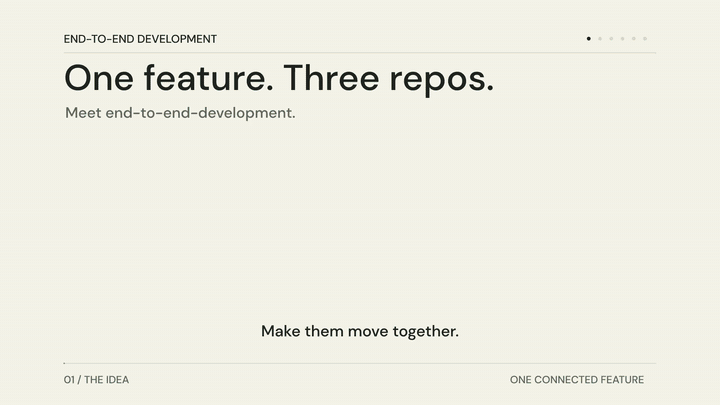

# End-to-End Development

One request from your workspace root. Coordinated changes across your UI, backend, and contract repositories. Three open PRs, watched until green and mergeable.



A 34-second animated overview of one request becoming three open PRs.

## Try the workflow

Start your AI session in the directory containing your repositories:

```text
workspace/
├── ui/
├── backend/
└── contract/
```

Then request a feature:

```text
$end-to-end-development
Add order number and pickup date filters.
```

The agent inspects the workspace and generates a plan assigning each task to its owning repository. You describe the feature; the request does not need to name the repositories. In this example, the plan assigns filter parameters to the API contract, filtered queries to the backend, and filter controls to the UI.

The animation then shows how the AI coordinates focused workers, implements changes in dependency order, verifies and reviews the result, and watches a PR in each affected repository until it is mergeable. The example uses generic repositories and simulated checks and PRs. Actual PR count depends on which repositories need changes; required human approvals or other blockers are reported.

Read the [skill instructions](SKILL.md), [development workflow](DEVELOPMENT.md), and [delivery guidance](DELIVERY.md). The [animation source and reproduction instructions](assets/intro/README.md) are included.
